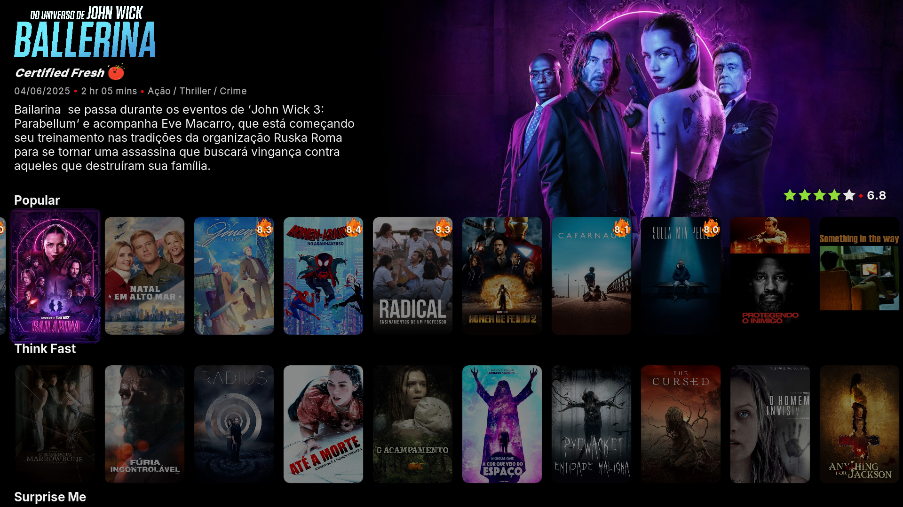
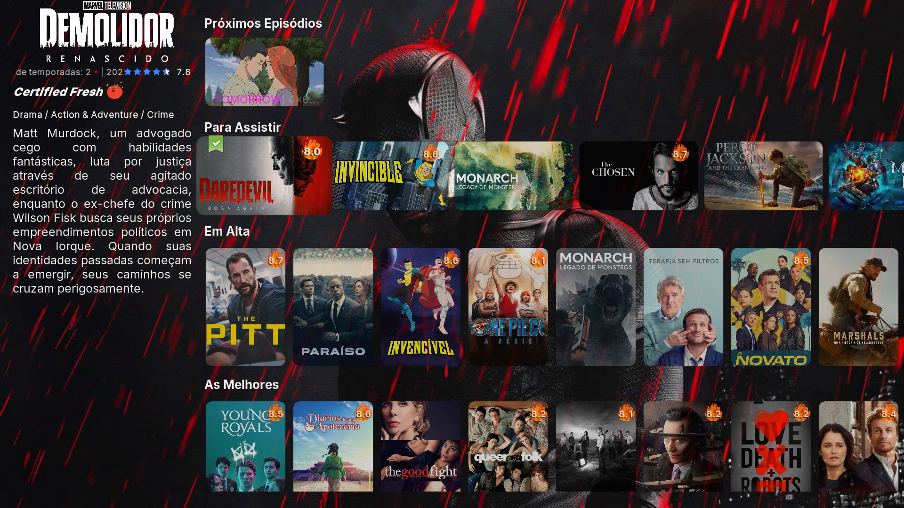

# Jediflix 🎬

Repositório com recursos e customizações para o **Kodi**, trazendo skins e scripts para aprimorar sua experiência.

## 📂 Estrutura do Projeto

- **POV – Stremio-like Loading Skin**  
  Personalização visual inspirada no **Stremio**, trazendo uma experiência de carregamento mais clean.

- **script.showimdb**  
  Helper universal para exibir notas do **IMDb**, **Trakt** e **Letterboxd**, mostrar comentários do Trakt e reproduzir o trailer em VideoWindow (permite continuar navegando normalmente). Yeppp! Todas vão de 0 a 10 para fácilitar (conversão feita via script)

- **skin.dstealthtv/**  
  Skin leve inspirada no visual da **Netflix**, mas que mantém elementos da **Estuary** por nostalgia.

## 🚀 Como Utilizar

1. Baixe o recurso desejado diretamente do GitHub.  
2. Instale o arquivo `.zip` no Kodi em **Add-ons > Instalar via arquivo zip**.  
3. Ative e aproveite! 🎉
4. Why limit your self? Escolha o estilo que preferir: standard (netflix like), wide (my precious) e wider (amazon like)
5. Implementado lógica de trailer extremamente robusta e que não quebra a imersão: 1º verifica o imdb (cobre 99% dos casos); caso falhe, tenta buscar o trailer pelo tmdb; caso falhe, procura pelo nome+trailer+oficial*. Daí, se tudo der errado, não assiste o filme porque é só você que quer ver 😜

*Obs.: Para implementar o trailer oficial sem quebrar a imersão (abrir o plugin do youtube custa recursos de processamento... demora a carregar e ainda dá uma travada na UI) e, considerando que somente até 720p há videos no youtube embedded com audio+video no mesmo arquivo, a qualidade dos fallback é limitada a 720p (Imdb é 1080p ou 720p), mas na maioria são 360p.

## 🤝 Contribuição

- Faça um **fork** do repositório.  
- Adicione seus recursos ou melhorias.  
- Abra um **Pull Request** para análise.  

Sugestões e melhorias são sempre bem-vindas!

## 📜 Licença

Este projeto pode incluir arquivos de terceiros. Consulte os arquivos individuais para verificar informações de licença.

